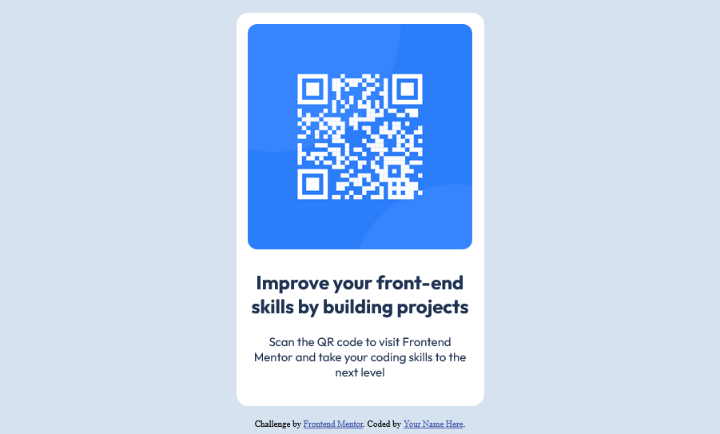

# Frontend Mentor - QR code component solution

This is a solution to the [QR code component challenge on Frontend Mentor](https://www.frontendmentor.io/challenges/qr-code-component-iux_sIO_H). 

## Table of contents

- [Overview](#overview)
  - [Screenshot](#screenshot)
  - [Links](#links)
- [Author](#author)

## Overview

### Screenshot

### Links

- Solution URL: [GitHub](https://github.com/asakags/fe-mentor/tree/main/qr-code-component-main)

## Author

- Frontend Mentor - [@asakags](https://www.frontendmentor.io/profile/asakags)
